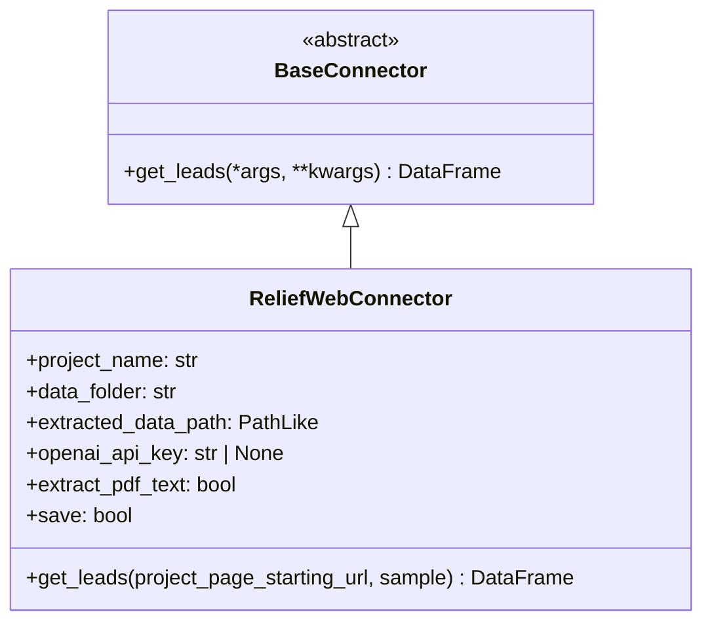
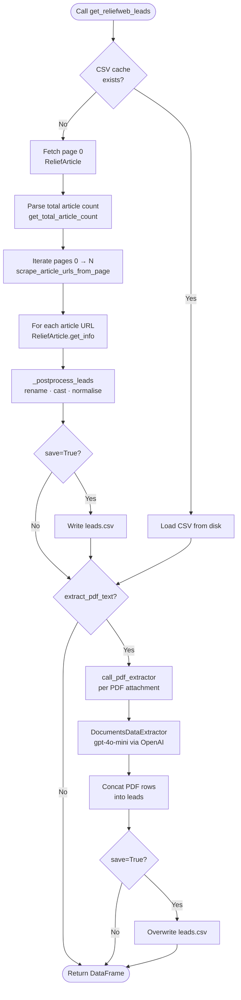
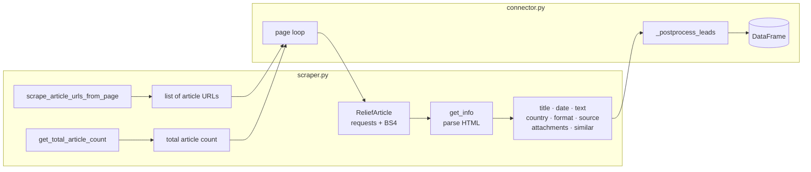

# DataConnectors

Pluggable data-ingestion connectors for **Media Monitoring & Analysis** pipelines.  
Each connector scrapes, normalises, and optionally enriches documents from a specific source into a common `pandas.DataFrame` schema ready for downstream analysis.

---

## Table of Contents

- [Installation](#installation)
- [Architecture](#architecture)
- [Quick Start](#quick-start)
- [Connectors](#connectors)
  - [ReliefWeb](#reliefweb)
- [Output Schema](#output-schema)
- [Pipeline Flow](#pipeline-flow)
- [Adding a New Connector](#adding-a-new-connector)
- [Environment Variables](#environment-variables)
- [Development](#development)
- [License](#license)

---

## Installation

```bash
pip install git+https://github.com/MediaMonitoringAndAnalysis/DataConnectors
```

**Optional – PDF text extraction** (requires an OpenAI API key):

```bash
pip install "git+https://github.com/MediaMonitoringAndAnalysis/DataConnectors#egg=data-connectors[pdf]"
pip install git+https://github.com/MediaMonitoringAndAnalysis/documents_processing
```

---

## Architecture

### Package structure

```
data_connectors/
├── __init__.py                  ← top-level exports
├── base.py                      ← BaseConnector (ABC)
└── reliefweb/
    ├── __init__.py
    ├── connector.py             ← get_reliefweb_leads(), ReliefWebConnector
    ├── scraper.py               ← ReliefArticle, ReliefArticleAPI, helpers
    ├── pdf_extractor.py         ← call_pdf_extractor()
    └── sources_metadata.json   ← bundled source-type metadata
```

### Connector class hierarchy



---

## Quick Start

```python
from data_connectors import get_reliefweb_leads

leads = get_reliefweb_leads(
    project_page_starting_url=(
        "https://reliefweb.int/updates"
        "?advanced-search=%28PC220%29_%28DO20241109-%29&page={}"
    ),
    project_name="sudan_2024",
    data_folder="data/sudan_2024",
    extracted_data_path="data/sudan_2024/leads.csv",
    extract_pdf_text=False,   # set True + OPENAI_API_KEY to also extract PDF text
)

print(leads.shape)      # e.g. (312, 10)
print(leads.dtypes)
print(leads.head(3))
```

**Sample output:**

```
(312, 10)

doc_id                      object
Entry Type                  object
entry_fig_path              object
Document Title              object
Document URL                object
Primary Country             object
Document Format             object
Document Publishing Date    object
Document Source             object
attachments                 object
text                        object
dtype: object

               doc_id      Entry Type entry_fig_path                             Document Title  \
0  reliefweb_1212345  Reliefweb Website              -  Sudan: Humanitarian Situation Report ...
1  reliefweb_1198732  Reliefweb Website              -  UNHCR Sudan Emergency Update #42 ...
2  reliefweb_1187654  Reliefweb Website              -  Sudan Crisis – WFP Situation Report ...

              Document URL Primary Country        Document Format Document Publishing Date  \
0  https://reliefweb.int/…           Sudan  [Situation Report]              2024-11-15
1  https://reliefweb.int/…           Sudan  [Situation Report]              2024-11-10
2  https://reliefweb.int/…           Sudan       [UN Document]              2024-11-08

            Document Source                   attachments  \
0             [OCHA, UNHCR]  [https://…/ocha_sudan_42.pdf]
1                   [UNHCR]  [https://…/unhcr_update.pdf]
2                     [WFP]                            [-]

                                                text
0  Since the onset of the conflict in April 2023, ...
1  UNHCR continues to monitor the humanitarian ...
2  The food security situation in Sudan remains ...
```

---

## Connectors

### ReliefWeb

Scrapes situation reports and updates from [reliefweb.int](https://reliefweb.int) via HTML parsing (BeautifulSoup) — no API key required.

#### Function signature

```python
from data_connectors import get_reliefweb_leads

leads: pd.DataFrame = get_reliefweb_leads(
    project_page_starting_url: str,
    project_name: str,
    data_folder: str,
    extracted_data_path: os.PathLike,
    openai_api_key: str | None = None,   # falls back to OPENAI_API_KEY env var
    extract_pdf_text: bool = True,
    save: bool = True,
    sample: bool = False,
)
```

| Parameter | Type | Description |
|-----------|------|-------------|
| `project_page_starting_url` | `str` | ReliefWeb search URL with `{}` placeholder for the page number. |
| `project_name` | `str` | Short identifier used as a sub-folder name (e.g. `"sudan_2024"`). |
| `data_folder` | `str` | Root directory for downloaded PDFs and intermediate CSVs. |
| `extracted_data_path` | `PathLike` | CSV cache file. If it already exists, scraping is skipped. |
| `openai_api_key` | `str \| None` | OpenAI key for PDF extraction. Falls back to `OPENAI_API_KEY`. |
| `extract_pdf_text` | `bool` | Run PDF extraction step (default `True`). |
| `save` | `bool` | Persist intermediate results to disk (default `True`). |
| `sample` | `bool` | Scrape only ~5 articles for quick testing (default `False`). |

#### Class-based usage

```python
from data_connectors import ReliefWebConnector

connector = ReliefWebConnector(
    project_name="sudan_2024",
    data_folder="data/sudan_2024",
    extracted_data_path="data/sudan_2024/leads.csv",
    extract_pdf_text=False,
)

leads = connector.get_leads(
    project_page_starting_url=(
        "https://reliefweb.int/updates"
        "?advanced-search=%28PC220%29_%28DO20241109-%29&page={}"
    ),
    sample=True,   # quick test: ~5 articles only
)
```

#### How to build a ReliefWeb search URL

1. Go to <https://reliefweb.int/updates> and apply your filters.
2. Copy the URL from the address bar.
3. Replace the `page=N` value with `{}` (or append `&page={}` if absent).

**Example** – Sudan updates since November 2024:
```
https://reliefweb.int/updates?advanced-search=%28PC220%29_%28DO20241109-%29&page={}
```

---

## Output Schema

Every connector returns a `pandas.DataFrame` with the following columns:

| Column | Type | Example |
|--------|------|---------|
| `doc_id` | `str` | `"reliefweb_1212345"` |
| `Entry Type` | `str` | `"Reliefweb Website"` |
| `entry_fig_path` | `str` | `"-"` |
| `Document Title` | `str` | `"Sudan Situation Report #42"` |
| `Document URL` | `str` | `"https://reliefweb.int/report/…"` |
| `Primary Country` | `str` | `"Sudan"` |
| `Document Format` | `list[str]` | `["Situation Report"]` |
| `Document Publishing Date` | `str` | `"2024-11-15"` |
| `Document Source` | `list[str]` | `["OCHA", "UNHCR"]` |
| `attachments` | `list[str]` | `["https://…/report.pdf"]` |
| `text` | `str` | `"Since the onset of the conflict…"` |

> When `extract_pdf_text=True`, additional rows with `Entry Type = "PDF Text"` are appended — one row per extracted page/section.

---

## Pipeline Flow



### Scraper internals



---

## Adding a New Connector

### 1. Create the sub-package

```
data_connectors/
└── acaps/
    ├── __init__.py
    ├── connector.py    ← public get_acaps_leads() + AcapsConnector
    └── scraper.py      ← source-specific scraping logic
```

### 2. Subclass `BaseConnector`

```python
# data_connectors/acaps/connector.py
from data_connectors.base import BaseConnector
import pandas as pd

class AcapsConnector(BaseConnector):
    def get_leads(self, *args, **kwargs) -> pd.DataFrame:
        # ... scraping logic ...
        return pd.DataFrame(...)

def get_acaps_leads(...) -> pd.DataFrame:
    return AcapsConnector().get_leads(...)
```

### 3. Expose from the sub-package `__init__.py`

```python
# data_connectors/acaps/__init__.py
from .connector import AcapsConnector, get_acaps_leads

__all__ = ["get_acaps_leads", "AcapsConnector"]
```

### 4. Re-export from the top-level `__init__.py`

```python
# data_connectors/__init__.py
from .reliefweb import ReliefWebConnector, get_reliefweb_leads
from .acaps import AcapsConnector, get_acaps_leads

__all__ = [
    "get_reliefweb_leads",
    "ReliefWebConnector",
    "get_acaps_leads",
    "AcapsConnector",
]
```

### 5. Add dependencies to `pyproject.toml`

```toml
[project.dependencies]
# ... existing deps ...
"acaps-specific-lib>=1.0",
```

---

## Environment Variables

| Variable | Used by | Description |
|----------|---------|-------------|
| `OPENAI_API_KEY` | ReliefWeb PDF extractor | Required when `extract_pdf_text=True`. |

Create a `.env` file in your project root (already in `.gitignore`):

```env
OPENAI_API_KEY=sk-...
```

`python-dotenv` is loaded automatically.

---

## License

AGPL-3.0 — see [LICENSE](LICENSE).
